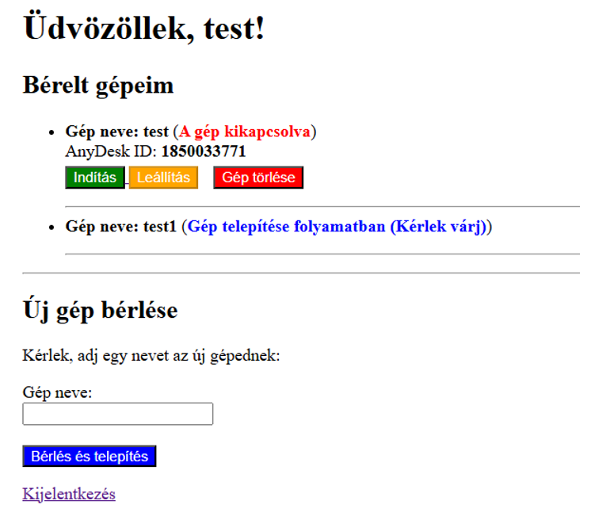

# Gépkikötő

## Projekt bemutatása

A Gépkikötő egy webalapú virtuálisgép-bérlő rendszer, amely lehetővé teszi a felhasználók számára saját Windows alapú virtuális gépek létrehozását, kezelését és távoli elérését.

A rendszer a háttérben automatikusan létrehozza a virtuális gépet, telepíti a Windows operációs rendszert, beállítja a szükséges környezetet, majd AnyDesk segítségével biztosít távoli hozzáférést a felhasználó számára.

## Főbb funkciók

- Felhasználói regisztráció és bejelentkezés
- Virtuális gépek bérlése webes felületen
- Automatikus Windows telepítés
- AnyDesk automatikus telepítése
- AnyDesk azonosító kinyerése
- Virtuális gépek indítása
- Virtuális gépek leállítása
- Virtuális gépek törlése
- Bérlések nyomon követése

## Alkalmazott technológiák

### Backend

- PHP
- MySQL
- PDO

### Automatizálás

- PowerShell
- Batch (.bat)
- VBoxManage

### Virtualizáció

- Oracle VirtualBox
- Windows 10

### Távoli elérés

- AnyDesk

### Fejlesztői környezet

- XAMPP

## Rendszer működése

1. A felhasználó regisztrál és bejelentkezik.
2. Új virtuális gépet hoz létre.
3. A rendszer elindítja a PowerShell automatizáló szkriptet.
4. A VirtualBox létrehozza a virtuális gépet.
5. Automatikusan települ a Windows.
6. Települ a Guest Additions és az AnyDesk.
7. A rendszer eltárolja az AnyDesk azonosítót.
8. A felhasználó a kezelőfelületen keresztül elérheti és kezelheti a gépet.

## Projekt felépítése

```text
website/
    PHP weboldal

powershell/
    Automatizáló szkriptek

docs/
    Dokumentáció

```

## Képernyőképek

### Kezelőfelület



## Ismert korlátozások

Jelenleg két funkció igényel manuális beavatkozást:

- Az UAC teljes kikapcsolása
- Az AnyDesk első csatlakozásának jóváhagyása

A rendszer minden más funkciója automatikusan működik.

## Fejlesztő

Név: Vadász Gergő